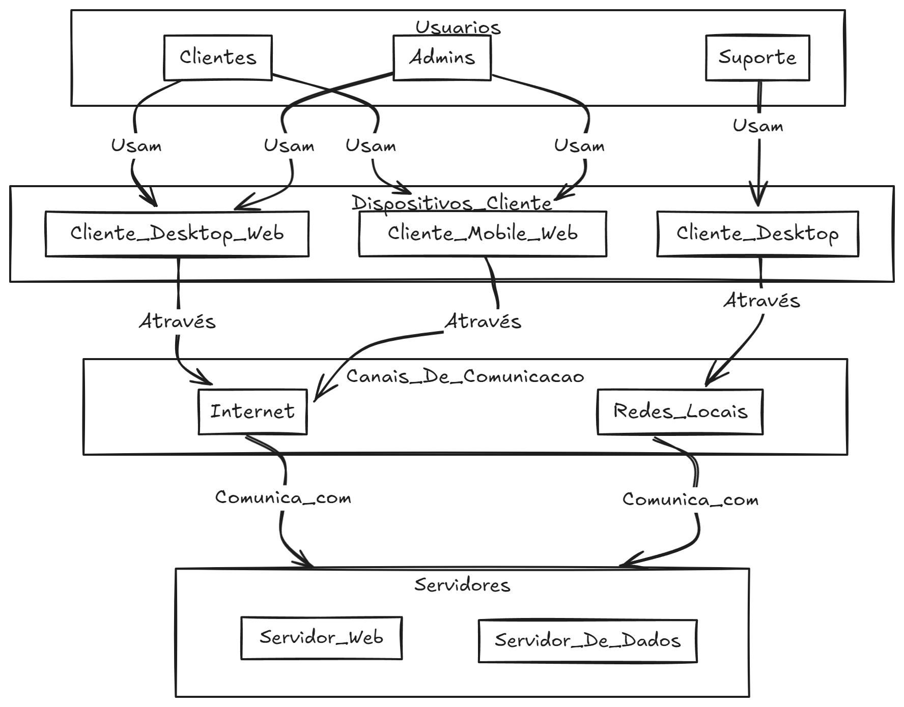

---

<h1>Visão do Produto</h1>

<h2>Sistema de Gestão de Processos Judiciais (SGPJ)</h2>

<small>Versão 1.0</small>

---

## Histórico de revisões

|    Data    | Versão |           Descrição           |      Autor       |
| :--------: | :----: | :---------------------------: | :--------------: |
| 21/08/2024 |  1.0   |     Criação do documento      | Equipe 4         |

---

## Sumário

- [Introdução](#introdução)
  - [Propósito](#propósito)
  - [Definições e abreviações](#definições-e-abreviações)
    - [Abreviações](#abreviações)
    - [Definições](#definições)
  - [Escopo do produto](#escopo-do-produto)
- [Posicionamento](#posicionamento)
  - [Oportunidade de negócios](#oportunidade-de-negócios)
  - [Descrição dos benefícios para os clientes e dos problemas resolvidos](#descrição-dos-benefícios-para-os-clientes-e-dos-problemas-resolvidos)
- [Descrição dos stakeholders e dos usuários](#descrição-dos-stakeholders-e-dos-usuários)
  - [Stakeholders](#stakeholders)
  - [Usuários e atores](#usuários-e-atores)
- [Descrição do ambiente de uso](#descrição-do-ambiente-de-uso)
  - [Ambiente de uso](#ambiente-de-uso)
  - [Necessidades principais quanto ao ambiente](#necessidades-principais-quanto-ao-ambiente)
- [Visão geral do produto](#visão-geral-do-produto)
  - [Visão geral](#visão-geral)
  - [Custo e venda](#custo-e-venda)
  - [Licenciamento e instalação](#licenciamento-e-instalação)
  - [Características e funcionalidades de alto nível](#características-e-funcionalidades-de-alto-nível)
  - [Restrições](#restrições)

---

# Introdução

O Documento de Visão do Produto (DVP) para o **Sistema de Gestão de Processos Judiciais (SGPJ)** descreve o software a ser desenvolvido para escritórios de advocacia. O sistema tem como objetivo automatizar a gestão de processos judiciais, leitura de diários e intimações, e auxiliar advogados e suas equipes na organização dos prazos e atividades relacionadas às demandas judiciais.

## Propósito

O objetivo deste documento é coletar, analisar e definir as necessidades de alto nível do **SGPJ**. Ele se concentra em oferecer funcionalidades que aumentem a produtividade dos escritórios de advocacia, garantindo uma maior eficiência no acompanhamento dos processos judiciais.

## Definições e abreviações

### Abreviações

| Termo | Definição                                    |
| :---: | -------------------------------------------- |
|  DVP  | Documento de Visão do Produto                |
|  PJE  | Processo Judicial Eletrônico                 |
| SGPJ  | Sistema de Gestão de Processos Judiciais     |

### Definições

| Termo      | Definição                                                                                  |
| :--------: | ------------------------------------------------------------------------------------------ |
| Advogado   | Profissional que utiliza o sistema para gerir processos judiciais e prazos.                 |
| Processo   | Conjunto de documentos relacionados a um caso judicial específico.                          |
| Intimação  | Notificação oficial enviada pelo tribunal para informar sobre uma ação judicial.            |
| Diário     | Publicação oficial onde são divulgadas decisões judiciais e intimações.                     |
| Agenda     | Ferramenta de organização de prazos e compromissos judiciais integrada ao SGPJ.             |

## Escopo do produto

O **Sistema de Gestão de Processos Judiciais (SGPJ)** é um sistema desenvolvido para auxiliar escritórios de advocacia na gestão de processos judiciais, intimações, e prazos. O sistema será utilizado por advogados e funcionários administrativos para organizar e acompanhar os processos em andamento, simplificando o fluxo de trabalho e aumentando a produtividade.

---

# Posicionamento

## Oportunidade de negócios

O **SGPJ** oferece várias oportunidades de negócios, incluindo:

1. **Serviço de assinatura**: Escritórios de advocacia podem pagar uma taxa mensal ou anual para utilizar o SGPJ, com diferentes níveis de serviço de acordo com o porte do escritório.
2. **Customizações e consultoria**: Para grandes escritórios, o sistema pode ser customizado para atender necessidades específicas, oferecendo serviços de consultoria especializada.
3. **Expansão para outros mercados**: O sistema pode ser adaptado para atender departamentos jurídicos de empresas ou outros setores que também gerenciam processos jurídicos.
4. **Integrações**: Possibilidade de expansão para integrar o sistema com plataformas de automação de documentos, gestão de contratos ou sistemas de contabilidade.

## Descrição dos benefícios para os clientes e dos problemas resolvidos

| Benefícios | Problemas Resolvidos | Afetados  |
| ---------- |--------------------- | --------- |
| Aumento da produtividade | Gestão manual de processos e prazos, que consome tempo e recursos. | Advogados e funcionários administrativos |
| Automação da leitura de diários da justiça | Necessidade de verificar manualmente os diários judiciais para identificar intimações e publicações.  | Advogados e funcionários administrativos |
| Organização de prazos e compromissos | Dificuldade de manter controle eficiente de prazos judiciais sem uma ferramenta integrada. | Advogados |
| Comunicação com clientes | Necessidade de gerar relatórios automáticos para informar os clientes sobre o andamento de seus processos. | Escritório de advocacia e clientes |

---

# Descrição dos stakeholders e dos usuários

## Stakeholders

Segue abaixo a lista de stakeholders do **SGPJ**.

| Stakeholder | Descrição | Papel |
| ----------- | --------- | ----- |
| Escritórios de Advocacia | Organizações que utilizam o sistema para gerenciar processos judiciais e melhorar a produtividade de seus advogados e funcionários administrativos. | Usuário do sistema |
| Equipe de Desenvolvimento | Profissionais responsáveis por desenvolver e manter o sistema.                                                                                          | Desenvolvedores                                                 |
| Gerente de Projeto                     | Profissional responsável por gerenciar o projeto e garantir que o sistema seja entregue, ulizando os meios mais eficientes possíveis.                          | Gerente de Projeto                                              |
| Departamento de Atendimento ao Cliente | Profissionais que fornecem suporte técnico e treinamento para escritórios de advocacia que utilizam o sistema.                                            | Suporte ao cliente                                              |

## Usuários e atores

Segue tabela com os usuários e atores do sistema:

| Usuário                  | Descrição                                                                                                    | Responsabilidades                                                                                                                                                                                                                | Stakeholders                                                                 |
| ------------------------ | ------------------------------------------------------------------------------------------------------------ | -------------------------------------------------------------------------------------------------------------------------------------------------------------------------------------------------------------------------------- | ---------------------------------------------------------------------------- |
| Advogados                | Profissionais jurídicos que utilizam o sistema para gerenciar seus processos e prazos judiciais.              | Acompanhar e gerenciar processos, prazos, intimações e audiências.                                                                                                                          | Escritórios de Advocacia, Equipe de Desenvolvimento, Gerente de Projeto      |
| Funcionários Administrativos | Profissionais responsáveis pelo suporte administrativo no escritório de advocacia.                          | Gerenciar documentos, auxiliar na gestão de prazos e intimações, fornecer suporte administrativo aos advogados.                                                                             | Escritórios de Advocacia, Equipe de Desenvolvimento, Gerente de Projeto      |

---

# Descrição do ambiente de uso

## Ambiente de uso

A seguir, são descritos os ambientes em que o **SGPJ** será utilizado:

1. **Ambiente do Escritório**: O sistema será utilizado pelos advogados e funcionários administrativos em desktops e laptops para a gestão completa dos processos judiciais e prazos.
2. **Ambiente Mobile**: O sistema também será acessado por meio de dispositivos móveis, como smartphones e tablets, para que os advogados possam gerenciar seus compromissos e processos remotamente.
3. **Ambiente de Teste**: O sistema será testado em um ambiente controlado antes de ser disponibilizado para os usuários finais, garantindo que novas funcionalidades e correções sejam aplicadas de maneira segura.

## Necessidades principais quanto ao ambiente

A seguir, é apresentada uma tabela que descreve as necessidades dos clientes com relação à qualidade, desempenho, segurança, usabilidade e confidencialidade do sistema **SGPJ**, juntamente com sua prioridade, interesse, solução atual e soluções propostas:

| Necessidade                                                                                                                                              | Prioridade | Interesse                                                                                                                                                | Solução Atual                                                                                                                 | Soluções Propostas                                                                                                                                                                                                                                                       |
| -------------------------------------------------------------------------------------------------------------------------------------------------------- | ---------- | -------------------------------------------------------------------------------------------------------------------------------------------------------- | ----------------------------------------------------------------------------------------------------------------------------- | ------------------------------------------------------------------------------------------------------------------------------------------------------------------------------------------------------------------------------------------------------------------------ |
| **Qualidade:** O sistema deve ser confiável e livre de erros, bugs e falhas.                                                                             | Alta       | Os usuários esperam que o sistema funcione corretamente e não apresente problemas que possam prejudicar o gerenciamento dos processos judiciais.          | Testes manuais realizados pela equipe de desenvolvimento.                                                                     | Implementar testes automatizados e processos de garantia de qualidade para identificar e corrigir erros e bugs.                                                                                                                                                          |
| **Desempenho:** O sistema deve ter um bom desempenho, com tempo de resposta rápido e sem atrasos significativos.                                         | Alta       | Os usuários esperam que o sistema responda rapidamente às suas solicitações e não apresente atrasos.                                                     | Servidor dedicado para hospedagem do sistema e monitoramento constante do desempenho.                                         | Melhorar a arquitetura do sistema para garantir melhor desempenho e escalabilidade, bem como otimizar consultas de banco de dados e uso de recursos do sistema.                                                                                                          |
| **Escalabilidade:** O sistema deve ter capacidade para suportar o crescimento do número de usuários e processos.                                         | Alta       | Os usuários esperam que o sistema continue funcionando de forma confiável, mesmo com um grande número de processos e usuários.                            | Arquitetura escalável, com distribuição de carga e uso de servidores em nuvem.                                                | Implementar arquitetura em nuvem e balanceamento de carga para garantir a escalabilidade do sistema.                                                                                                                                                                     |
| **Segurança:** O sistema deve ser seguro, protegido contra acesso não autorizado, invasões e roubo de dados.                                             | Alta       | Os usuários esperam que suas informações estejam seguras e protegidas contra invasões e acesso não autorizado.                                           | Autenticação de usuários com login e senha, criptografia de dados sensíveis e acesso restrito somente a usuários autorizados. | Implementar medidas adicionais de segurança, como autenticação de dois fatores, certificados SSL e criptografia avançada.                                                                                                                                                |
| **Usabilidade:** O sistema deve ser fácil de usar e entender, com uma interface intuitiva e amigável ao usuário.                                         | Moderada   | Os usuários esperam que o sistema seja fácil de usar e entender, sem a necessidade de treinamento especializado.                                         | Interface de usuário simples e intuitiva.                                                                                     | Realizar testes de usabilidade com usuários reais para identificar áreas de melhoria e implementar melhorias na interface do usuário.                                                                                                                                    |
| **Tempo de resposta:** O sistema deve ter um tempo de resposta rápido para que os usuários possam acessar e gerenciar seus processos de forma eficiente. | Moderada   | Os usuários esperam que o sistema responda às suas solicitações rapidamente para que possam gerenciar seus processos de forma mais eficiente.             | Monitoramento constante do tempo de resposta do sistema.                                                                      | Realizar otimizações de performance, como o uso de cache, e garantir que o sistema esteja sempre atualizado para obter um tempo de resposta rápido.                                                                                                                      |
| **Confidencialidade:** O sistema deve proteger a privacidade e confidencialidade das informações dos processos e dos clientes.                           | Alta       | Os usuários esperam que suas informações sejam mantidas em sigilo e protegidas contra acesso não autorizado.                                             | Controles de acesso restrito, criptografia de dados sensíveis e monitoramento constante das atividades do usuário.            | Realizar auditorias de segurança e implementar medidas adicionais de privacidade e proteção de dados, como política de privacidade clara e concisa, consentimento explícito do usuário para coleta e uso de dados, e implementação de protocolos de segurança avançados. |

---

# Visão geral do produto

## Visão geral

O sistema **SGPJ** é uma solução de gestão de processos judiciais que permite aos advogados e funcionários administrativos organizarem e acompanharem seus processos, prazos e intimações. O sistema oferece ferramentas para facilitar a leitura automática de diários da justiça e intimações, a gestão de prazos e o acompanhamento de processos em curso, permitindo que o escritório de advocacia aumente a sua produtividade e a sua eficiência.

O sistema pode ser acessado tanto por desktops quanto por dispositivos móveis, e conta com recursos de segurança e confiabilidade que garantem a proteção das informações sensíveis dos processos e dos clientes.

Uma estrutura operacional do produto é apresentada na figura abaixo.

## Custo e venda

A decisão sobre a viabilidade econômica e planejamento de custos do **SGPJ** envolve o departamento comercial, gerente de projetos e os escritórios de advocacia, que serão os principais clientes do sistema. O produto pode ser vendido como um serviço por assinatura, ou licenciado com personalizações para grandes escritórios.

## Licenciamento e instalação

O **SGPJ** será licenciado por meio de uma licença de uso, que será fornecida pela empresa desenvolvedora do software. O sistema poderá ser instalado em servidores do próprio cliente ou em nuvem, desde que atendam aos requisitos de infraestrutura previstos.

A instalação pode ser realizada de forma autônoma pelo cliente, ou pela equipe técnica da empresa desenvolvedora, mediante contratação de serviços de instalação e configuração. A empresa fornecerá suporte técnico durante e após a instalação.

## Características e funcionalidades de alto nível

1. **Leitura Automática do PJE**: O sistema deve ser capaz de ler automaticamente as intimações no PJE e categorizá-las.
2. **Agenda de Prazos e Compromissos**: O sistema deve permitir a criação de uma agenda para gerenciamento de prazos, audiências e compromissos, com a opção de download em PDF.
3. **Cadastro de Clientes e Processos**: O sistema deve possibilitar o registro de clientes e seus respectivos processos, armazenando dados pessoais e informações das demandas judiciais.
4. **Leitura de Diários Judiciais**: O sistema deve identificar publicações nos diários judiciais que mencionem advogados cadastrados.
5. **Relatórios para Clientes**: O sistema deve permitir a geração de relatórios automáticos sobre o status dos processos, para envio aos clientes que solicitarem.
6. **Gestão de Equipe**: O sistema deve registrar quais advogados ou estagiários atuaram em cada fase dos processos.
7. **Segurança de Dados**: O sistema deve garantir a segurança das informações, com autenticação de usuários e controle de permissões.
8. **Usabilidade**: O sistema deve ser intuitivo, fácil de usar e adaptado para dispositivos móveis e desktops.

## Restrições

Algumas possíveis restrições que podem ser aplicadas ao sistema são:

1. **Restrição de segurança e privacidade:** O sistema deve atender aos requisitos rigorosos de segurança para proteger o sigilo das informações dos processos.
2. **Restrição de desempenho:** O sistema deve ser rápido e eficiente, com tempo de resposta curto e sem falhas.
3. **Restrição de usabilidade:** O sistema deve ser fácil de usar e intuitivo, sem exigir treinamento especializado.

---

Data: 21 de agosto de 2024

**Validado por:**

<address>
<a href="mailto:equipe4@equipe4.com.br">Equipe 4</a> | Desenvolvimento de Software 
equipe4@equipe4.com.br 
equipe4.com 
Av. Epitácio Pessoa, S/N, João Pessoa(PB) 
BRA
</address>

---

Criado em Agosto de 2024 por Equipe 4

---